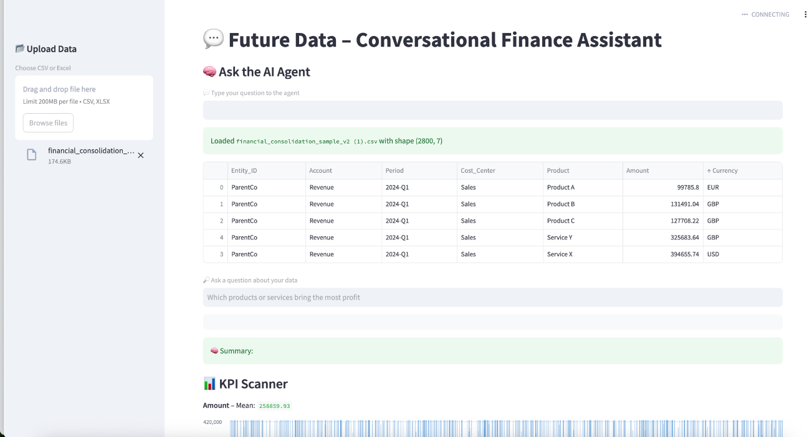

# FutureData AI Agent

Welcome to **FutureData AI Agent** — your intelligent virtual assistant for financial data analysis.

This Streamlit-based tool allows you to upload spreadsheet files (CSV/Excel), ask natural language questions, receive Python-powered answers, view KPIs and anomalies, and export actionable insights. 

 
---
## File Structure

📁 future_data_ai_agent_complete/  
├── future_data_ai_agent_complete.py     # Main Streamlit app  
├── README.md                            # This file  
├── todo.md                              # Auto-generated by the app  
├── index.html                           # HTML structure of the landing page  
├── style.css                            # Styles for the landing page  
└── script.js                            # JavaScript functionality for the landing page 

## Example Use Case

Imagine uploading a credit risk dataset. You can:

Ask: "What is the average PD by region?"

See the auto-generated chart and summary

Get a TODO: "- Investigate anomaly in PD column"

Export your TODO and share with the team

## Roadmap
🔜 Coming soon:

PDF export

Email reports

Multi-language TTS

Custom alert logic with scheduling

ERP and QuickBooks connectors

##  Features

✅ **Upload CSV or Excel**  
✅ **Conversational interface with AI (Mixtral via Ollama)**  
✅ **Code generation using LLM (Python + Pandas)**  
✅ **TTS (Text-to-Speech) in English**  
✅ **Summary generator for each query**  
✅ **KPI scanner** — highlights key metrics  
✅ **Anomaly detection** — finds outliers using Z-score  
✅ **Auto-generated TODO list** — suggestions based on insights  
✅ **Downloadable TODO.md and logs**  
✅ **Agent Activity Log** — visible step-by-step execution  
✅ **Modern UI with styled buttons and layout**

---

##  Tech Stack

- [Streamlit](https://streamlit.io) – UI and app runtime  
- [Mixtral via Ollama](https://ollama.com/library/mixtral) – LLM for code generation and summaries  
- [Pandas](https://pandas.pydata.org) – Data manipulation  
- [Matplotlib](https://matplotlib.org) – Charts and plots  
- [Scipy Z-Score](https://docs.scipy.org/doc/scipy/) – Outlier detection  
- [FPDF](https://pyfpdf.github.io/fpdf2/) *(optional)* – PDF report export (planned)  
- [Web Speech API](https://developer.mozilla.org/en-US/docs/Web/API/SpeechSynthesis) – Browser-based English voice responses

---

## Built by
Future Data team — turning spreadsheets into smart systems with the help of AI.
Inspired by Manus AI, Replit AI, and the power of modern LLMs.

## Contact
Have feedback or want to contribute?

📧 Email us at: konar.inna@gmail.com  

🌐 Website (Coming Soon):https://futuredata-ai.netlify.app/  
